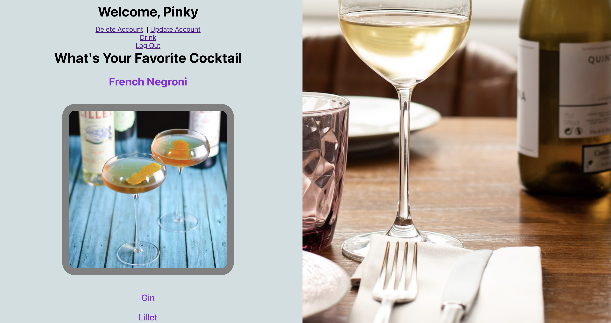

# React + Vite

# MERN CRUD User and Third-Party API Drinking App

## Introduction
Welcome to the MERN CRUD User and Third-Party API Drinking App! This project is designed to provide a comprehensive example of a web application built with the MERN stack (MongoDB, Express.js, React.js, and Node.js) that allows users to perform CRUD (Create, Read, Update, Delete) operations for user profiles while also integrating a third-party API to provide drinking-related information. 



The application allows users to create, read, update, and delete user profiles, providing essential functionalities for managing user data. Additionally, it leverages a third-party API to fetch data related to various alcoholic beverages, such as cocktails, ingredients, and recipes, enhancing the user experience with exciting and relevant content.

## Technologies Used
- MongoDB: A NoSQL database for storing user data.
- Express.js: A Node.js framework for building the backend API.
- React.js: A JavaScript library for building the frontend user interface.
- Node.js: A JavaScript runtime for building server-side applications.
- Axios: A promise-based HTTP client for making API requests.
- Third-Party API (e.g., TheCocktailDB API): Used to fetch drinking-related information.
- Render: A cloud platform for deploying the app.
- Git and GitHub: Version control and collaborative development.

## Getting Started
- **Planning (Trello Board)**: You can find the project's planning and progress on our [Trello board](https://trello.com/b/nDhHof21/crud-mern-drink-heaven-app).

- **Deployed App**: Check out the deployed MERN CRUD User and Third-Party API Drinking App at [App Link](https://yourappurl.com).

To run the project locally:

1. Clone the repository: `git clone https://github.com/AshleyBrown11/MERN-Drink-Socially.git`
2. Navigate to the project folder: `cd your-repo`
3. Install dependencies for the backend and frontend:
   ```
   cd backend
   npm install
   cd ../frontend
   npm install
   ```
4. Set up your environment variables:
   - Create a `.env` file in the backend folder and add your MongoDB connection string and other required variables.
   - Add any necessary configuration for the third-party API.
   
5. Start the backend server:
   ```
   cd backend
   npm start
   ```
6. Start the frontend development server:
   ```
   cd frontend
   npm start
   ```

Now, you can access the app in your web browser at `http://localhost:5173`.

## Unsolved Problems
- Implementing pagination and filtering for a better user experience when viewing a large number of user profiles.
- Allowing the user to search for their favorite drink.
- Enhancing error handling and validation for a more robust application.

## Future Enhancements
- Integration with additional third-party APIs to provide more diverse drinking-related content.
- Providing drinking game ideas for parties.
- Implementing real-time updates using WebSockets for a more interactive experience.
- Mobile responsiveness and improved UI/UX design.
- Deployment automation and continuous integration (CI/CD) for smoother updates and releases.
- Unit and integration testing to ensure code reliability and stability.

We welcome contributions and suggestions to make this MERN CRUD User and Third-Party API Drinking App even better! Feel free to fork the project, create pull requests, or open issues to discuss potential improvements.